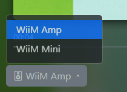
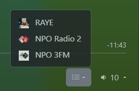
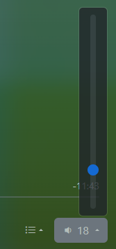

# WiiM Now Playing

<!-- Badges -->

Show what the WiiM device is currently playing on a touchscreen, separate screen or browser.

Examples:

  
*Tidal Flac*

  
*Spotify Lossless*

  
*TV Mode*

| *Device selection* | *Preset selection* | *Volume control* |
| :---: | :---: | :---: |
|  |  |  |

  
*Settings*

## "I just want it to run, here and now!"

See: [Getting Started](https://cvdlinden.github.io/wiim-now-playing/getting-started/)

## "I want to run it stand-alone on a Raspberry Pi (with a touchscreen)!"

If you want to run the wiim-now-playing app on a Raspberry Pi with or without a touchscreen, please refer to:

* [Deploying WiiM Now Playing on a Raspberry Pi](https://cvdlinden.github.io/wiim-now-playing/rpi/)
* [Setting up a Raspberry Pi in kiosk mode on a touchscreen](https://cvdlinden.github.io/wiim-now-playing/rpi/setup-touchscreen.html)
* [Setting up a Raspberry Pi in headless mode](https://cvdlinden.github.io/wiim-now-playing/rpi/setup-headless.html) if you want to run it stand-alone without a touchscreen or with an external screen over HDMI
* [Raspberry Pi requirements for a WiiM Now Playing setup](https://cvdlinden.github.io/wiim-now-playing/rpi/requirements.html)

## "I want to change things up!"

* [Development and debugging](https://cvdlinden.github.io/wiim-now-playing/development/)
* [Outstanding issues](https://github.com/cvdlinden/wiim-now-playing/issues)
* [Outstanding PRs](https://github.com/cvdlinden/wiim-now-playing/pulls)

Also see: [Reference](https://cvdlinden.github.io/wiim-now-playing/reference/)
