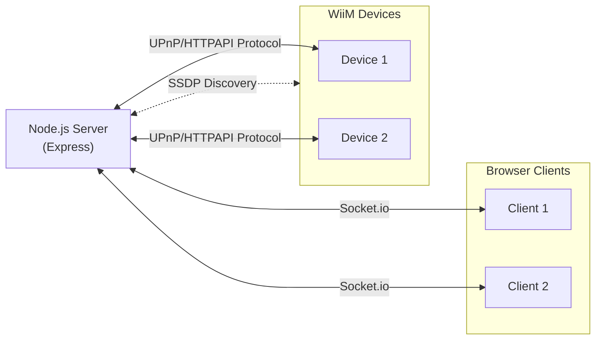

# Architecture

## Communication Flows

## Device - Server - Client model

### Server

Handles all of the communication and translation between the selected device and connected clients.

The server talks to the device over UPnP to get the most recent device information. It does so by polling every second.

Note: The server will only talk to **one** MediaRenderer at the time!

### Device(s)

The UPnP MediaRenderer device we want to the 'Now Playing' information from.

The main goal is to talk to WiiM (Amp) devices. But if possible, not limited to this family of devices. Most people will have other UPnP MediaRenderers in their home, possibly without their knowing.

### Client(s)

Mainly the client on the RPi itself to show the 'Now Playing' info on. But not limited to. Other clients can point their browser to the server and see the same information and control the server.

> [!NOTE]
> Because the server will only communicate to one MediaRenderer at the time. All of the connected clients will be in sync with each other. I.e. switching a device on one client will make all other clients switch as well.
