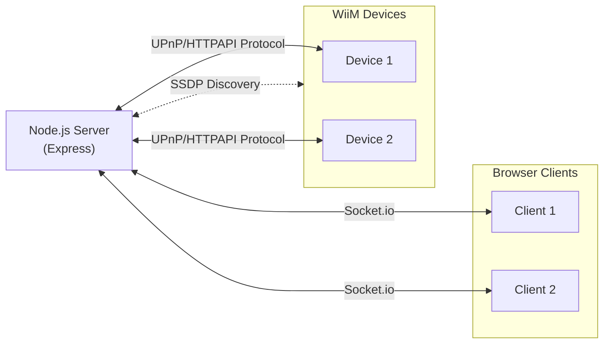

# Architecture

## Communication Flows

## Device - Server - Client model

### Server

Handles all of the communication and translation between the selected device and connected clients.

The server talks to the device over UPnP and the HTTP API to get the most recent device information and execute commands.

The server normally does get information by polling every second or larger time intervals.

> [!NOTE]
> The server will only talk to **one** MediaRenderer at the time!

### Device(s)

The WiiM (UPnP MediaRenderer) device we want to the 'Now Playing' information from.

The main goal is to talk to WiiM (Amp/Mini/Pro) devices. *But if possible, not limited to this family of devices. Most people will have other UPnP MediaRenderers in their home, possibly without their knowing.*

Multiple devices will be discovered, but only one can be actively used at a time per server.
However, you can add multiple servers to your home network in order to command several WiiM devices. Or just switch easily between devices from one server.

### Client(s)

Mainly the (kiosk) client on the RPi itself to show the 'Now Playing' info on.

But it is not limited to just that. Other clients with a browser (pc/laptop/tablet/mobile/tv) can point their browser to the server and see the same information and control the server.

There is no hard limit to the amount of clients that can talk to the server. In a home setup that would suffice. The limit has not been tested!

If no client is connected to the server, the server seizes to communicate (poll) with the device. Untill a new client connects to the server.

> [!NOTE]
> Because the server will only communicate to one MediaRenderer at a time. All of the connected clients will be in sync with each other. I.e. switching a device on one client will make all other clients switch as well.

## Technical stack

For a description of the used techniques/frameworks, see: [Reference/Design](../reference/design.md)
