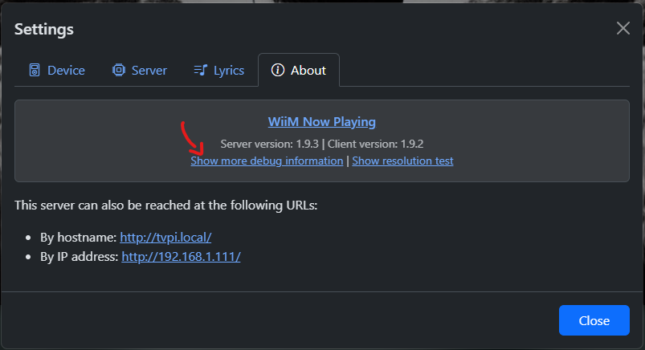

# Development and debugging

As per the [GNU General Public License v3.0](https://github.com/cvdlinden/wiim-now-playing/blob/main/LICENSE) you are free to (almost) do whatever you please with the provided code.

## You are free to run it anywhere you like

Although I would highly recommend to **only run it on your own private network**, since that is where your WiiM device(s) reside. Do not use on public networks as it may hand over control of your WiiM device(s) to total strangers.

## You are free to alter the code to your liking

Here are some pointers if you care to develop on your own:

1. [Server Side development](server.md) in [Node.js](https://nodejs.org/)
2. [Client Side development](client.md) with plain HTML/CSS/JS and [Parcel.js](https://parceljs.org/)
3. [Documentation development](documentation.md) with [VitePress](https://vitepress.dev/)

To understand the architecture of the WiiM Now Playing app, you may want to read up on its [Architecture](architecture.md).

If you have any feature request or bug report, please visit: [Issues](https://github.com/cvdlinden/wiim-now-playing/issues).

If you have some code improvements to offer, please visit: [Pull requests](https://github.com/cvdlinden/wiim-now-playing/pulls).

## Debugging communications

The app provides a debug page to show you what your WiiM Device is currently telling the app. For this you can visit Settings > About > Show more debug information.

The debug page will tell you what the WiiM Now Playing app currently knows about the media that is currently playing, the state, metadata, lyrics and more.

## IDE

For development I recommend [Visual Studio Code](https://code.visualstudio.com/). But any other devtool you prefer will suffice.
