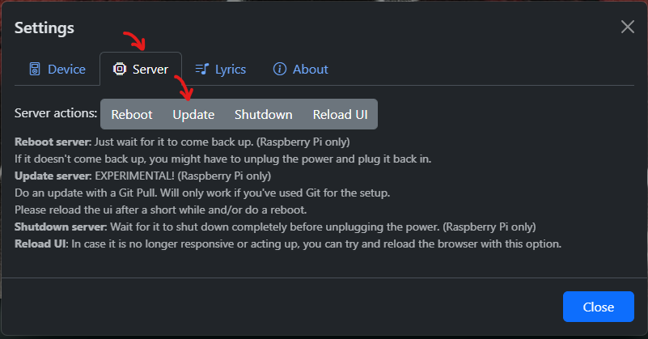
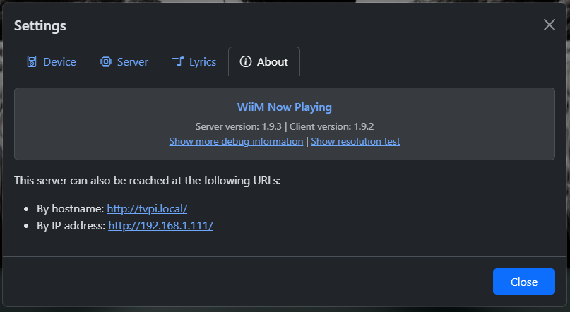

# Updating to the latest version

WiiM Now Playing is updated 'regularly'. Updating your installation depends on how you've installed WiiM Now Playing the first time.

## "I've installed via Git"

### In-app update on a Raspberry Pi (experimental!)

If installed via Git you can pull updates easily through the app on a Raspberry Pi.

1. Click on settings
2. Server tab
3. Click on Update



Now wait a while for the update to be pulled and installed. Then do a Reboot and wait for the Raspberry Pi to come up again.

> [!NOTE]
> You can find the current version under the About tab in the app.



### Out-of-app update (any system)

If there's a new version of the app you can easily update it through Git.

1. Open a (bash) command prompt, PowerShell or terminal window.
2. Execute the following commands:

   ```shell
   # Navigate to the folder where you previously installed the app, like:
   cd wiim-now-playing/

   # Pull the latest version from GitHub
   git pull

   # Install the latest dependencies
   npm install
   ```

   > [!CAUTION]
   > Note that npm install may warn you about vulnerabilities and prompt you to run 'npm audit fix --force'. Please don't, as this will break functionality.

3. For a proper update do a manual restart of node or just reboot the machine.

   ```shell
   # reboot the server manually
   sudo reboot
   ```

### Unable to update via Git

If the ``git pull`` doesn't work as expected you probably have some locally changed files that block the update.

Use ``git fetch`` followed by ``git status`` to check what files have changed locally. If you see a message ```Changes not staged for commit:```, followed by a list of files, you've found the blocking files.

If you want to retain those changes then copy these files over to another folder, so you can redo your changes later on.

Use e.g. ``git restore the-offending-file.js`` to undo the changes made for each file that ``git status`` reports. Now you can do another ``git pull``.

## "I've downloaded the ZIP package"

If you've installed by downloading the ZIP package before. You should be good by downloading the latest release from the [Releases page](https://github.com/cvdlinden/wiim-now-playing/releases) in this repo. Then unzip the downloaded ZIP package into the existing installation folder.

Please note that this will obviously overwrite anything already in the folder.  
So if you have made any changes of your own that you'd want to retain, please safeguard them beforehand!

A good strategy would be to rename the existing folder and unzip the download into a new folder with the previous foldername. Then redo any of your desired changes.

After unzipping the download to your folder, go into the folder with ``cd`` and do an ``npm install`` to update any required packages.

Afterwards restart node manually or do a reboot of the machine.

```shell
# reboot the server manually
sudo reboot
```

## "I've forked your repo"

If you've forked this repo here on Github then please read the Github documentation on [Sync a fork of a repository to keep it up-to-date with the upstream repository.](https://docs.github.com/en/pull-requests/collaborating-with-pull-requests/working-with-forks/syncing-a-fork)
