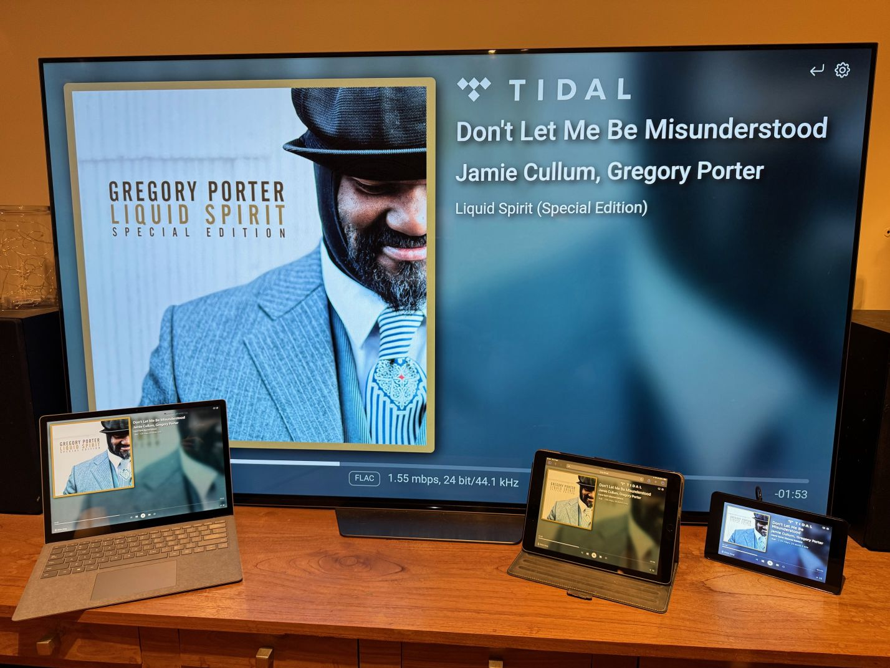

---
# https://vitepress.dev/reference/default-theme-home-page
layout: home

hero:
  name: "WiiM Now Playing"
  text: "Show what your WiiM device is currently playing."
  tagline: "For use on a Raspberry Pi. With or without a touchscreen."
  image: 
    src: /logo.png
    alt: "wiim-now-playing logo"
  actions:
    - theme: brand
      text: What is WNP?
      link: /features/
    - theme: alt
      text: Getting Started
      link: /getting-started/
    - theme: alt
      text: Installing on a Raspberry Pi
      link: /rpi/

features:
  - icon:
      src: /logo.png
    title: What can WiiM Now Playing do?
    details: "Transform a secondary screen into a dedicated music dashboard."
    link: /features/
    linkText: "Read more"
  - icon:
      src: /logo.png
    title: Getting Started
    details: "Get it up and running, the easy way."
    link: /getting-started/
    linkText: "Let's go!"
  - icon:
      src: /logo.png
    title: On a Raspberry Pi
    details: "Install WiiM Now Playing on a Raspberry Pi. With or without a touchscreen."
    link: /rpi/
    linkText: "Install"
---

## *Ready for any screen...*

