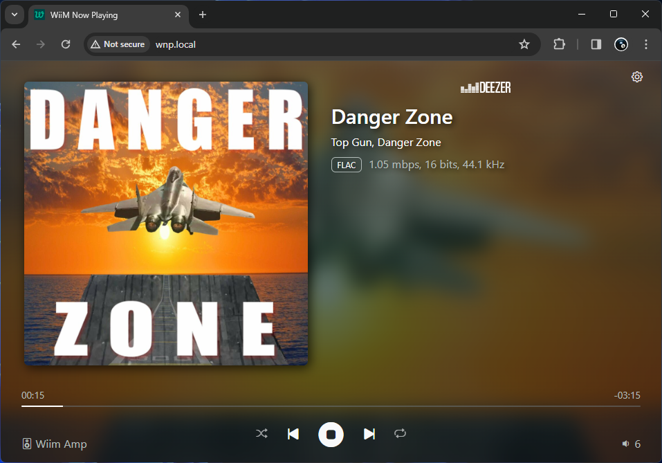

# Add the WiiM Now Playing solution to the RPi

In order to host the wiim-now-playing solution we will need to install Node.js and NPM first!

> [!CAUTION]
> Do not use the default ``apt install nodejs`` method as it will install a very old version of Node.js, without NPM.

## Update all packages

Now that the Raspberry Pi is running it is a good idea to do an update of all the installed packages, and possibly any firmware.

1. Make an SSH connection to the RPi.
2. Run the following commands in sequence:

   ```bash
   sudo apt update
   sudo apt upgrade
   ```

   *If any new packages are found, install them! It may take a while at the first time.*  
   *You may run these commands again, directly after or at any moment later, to make sure everything has been updated.*  
   *Optionally, you also may do a restart of the Raspberry Pi with a ```sudo reboot``` after the upgrade of the packages is done*

## Installing Node.js LTS version

> [!NOTE]
> Refer to the <https://nodesource.com/products/distributions> installation instructions for the latest stable LTS version of Node.js.  
> This will install the latest LTS version (24.x) of Node.js, with NPM.

1. Make an SSH connection to the RPi.
2. Run the following commands in sequence:

   ```shell
   sudo apt-get install -y curl
   curl -fsSL https://deb.nodesource.com/setup_24.x | sudo -E bash -
   sudo apt-get install -y nsolid
   nsolid -v
   ```

   *This will configure and install Node.js automatically on the device*

3. After the installation is done you can check whether the correct version of node and npm are installed. Running:  
   ``node -v`` should say version 24-something.  
   ``npm -v`` should say version 11-something.  
   *Higher is good, lower is bad.*

## Installing Git

Installing the wiim-now-playing app can be as simple as downloading the zip from Github (using curl). Then unzip to a folder, run ``npm install`` and ``node server/index.js``. If so, skip the following Git steps, you're good to go. although you may miss the option to ```git pull``` any updates released afterwards.

In this case we'll be using Git to clone the wiim-now-playing repo in order to always be able to get the latest version easily.

1. Make an SSH connection to the RPi.
2. Git could already be installed with your Raspberry Pi OS.  
   Run the following command to install and make sure:  

   ```shell
   sudo apt install git
   ```

3. You can check wich version of Git you have gotten now:  
   ``git -v`` should tell you which version you have. Version 2.40-something or higher is fine.

## Install wiim-now-playing using Git

Now that we are sure that we have Git and Node.js available we can get the wiim-now-playing sources from Github and install it.

1. Make an SSH connection to the RPi.
2. Make sure that you are in your home folder. You can tell by the command prompt line showing a ~ (tilde) sign, like ``user@server:~ $``.  
   If not, then use ``cd ~`` to go to your home folder.  
   *If your are so inclined to put the files anywhere else, feel free to do so.*
3. Run the following command to clone the wiim-now-playing repo:  

   ```shell
   git clone https://github.com/cvdlinden/wiim-now-playing.git
   ```

4. Then go into the wiim-now-playing folder using: 

   ```shell
   cd wiim-now-playing/
   ```

5. Using ``ls -la`` will give you the contents of the folder. It should contain a bunch of files and folders, that correspond to the Github repo.
6. Before starting the wiim-now-playing app you need to tell it once to get all of the dependencies, using:  

   ```shell
   npm install
   ```

   > [!CAUTION]
   > *It may tell you about some vulnerabilities. Those can be ignored for now as they seem to not be infuential currently. Fixing those **will break**npm  the app though.*  
   > *If it tells you there are errors, then please follow the instructions.*

7. Now we can start the wiim-now-playing app in order to test if it works. Use:  

   ```shell
   node server/index.js
   ```

8. If you are lucky it will start without question.  
   If not, check the next chapter!

## Enable Node.js to run on port 80

By default Raspberry Pi OS (Debian) does not like claiming port 80, the default WWW server port, as a non-root user. In order to claim port 80 as a non-root/sudo user, use ([found here](https://stackoverflow.com/questions/60372618/nodejs-listen-eacces-permission-denied-0-0-0-080)):

```shell
sudo apt install libcap2-bin 
sudo setcap cap_net_bind_service=+ep `readlink -f \`which node\``
```

Now you can try and run the wiim-now-playing app by using:

```shell
node server/index.js
```

If this doesn't work then please change the port variable in ./server/index.js, using ``nano wiim-now-playing/server/index.js``.  
Good candidates for alternative ports are: 8000, 8080, 5000 or 3000. See what works best for you.

> [!WARNING]
> Each time you update the Raspberry Pi OS you will need to use the ```setcap``` command again!

## Test the wiim-now-playing app

If you've started node correctly it will tell you it is running on 'localhost:80' or the likes.

1. Open up a browser tab on your computer.
2. Use the following address to see the app: ``servername.local``  
   Where servername is the hostname you set earlier. For example ``wnp.local``.
3. You should now see the app working:  
     
   Obviously you need to tell the Wiim device to play something first, use your WiiM Home app for that.

## Updating the app through Git

If there's a new version of the app you can easily update it through Git. Also see: [Updating to the latest version](../getting-started/updating.md)

1. Make an SSH connection to the RPi.
2. Go into the wiim-now-playing folder: ``cd wiim-now-playing/``
3. Use the ``git pull`` command to get the latest version of the app.  
   It will tell you whether you already are up-to-date or automatically download the latest version/additions.
4. You can then go to the app settings and reload the UI to check the latest UI changes.  
   But for a proper update do a reboot (either ``sudo reboot`` or a 'Reboot Server' through the app).

Hint: Read up on git and its commands to get a grip on what else it can do, like skipping back to an earlier version or a different branch. *Although definitely not required.*
