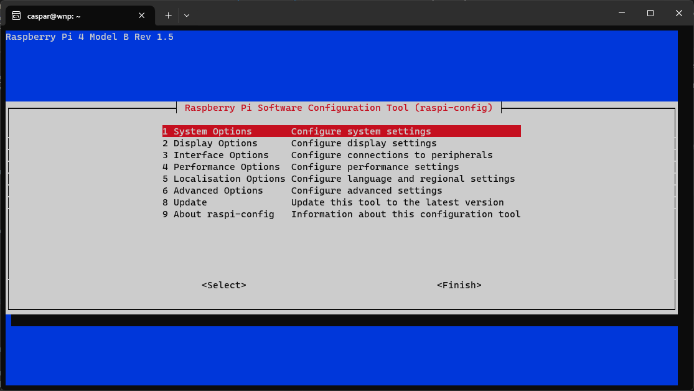

# Additional Kiosk mode configuration

Now that you have a [working Kiosk mode for the WiiM Now Playing app](setup-kiosk.md), there might be still some issues or things you may want to tweak.

The following subjects are optional.

[[toc]]

## Network issues, after startup

The OS and the chromium browser may have started up already before the network has been initialised. I.e. the screen lights up, but you can't reach it over the network and/or the WNP app isn't responsive.

It may help to connect the RPi directly through an Ethernet cable. WiFi is much slower to initialise than an ethernet connection. If it works fine with a cable and not over WiFi? Or just want to make sure the WiFi has started before anything else. Add the following.

If the network is slow to initialise you can add a wait state to the autostart script through ``nano autostart.sh``:

```bash
#!/bin/bash

# Wait for LAN to be enabled
while [ $(/usr/sbin/ifconfig | grep -cs 'broadcast') -lt 1 ]; do sleep 2; done
echo "WNP: hostname $(hostname -I)"
echo "WNP: broadcast $(/usr/sbin/ifconfig | grep -cs 'broadcast')"

# {the rest of your autostart.sh}

exit 0
```

This will make sure that the startup procedure waits for WiFi, before starting the chromium browser.

> A ```sudo reboot``` is required for the setting to take effect.

## Disable the Screensaver

By default the OS still has a screensaver/-blanking enabled. After a while your screen will go blank. If you always want to have the screen turned on, add the following lines at the beginning of the autostart.sh file:

1. Connect to the RPi through SSH.
2. Edit the autostart file:

   ```shell
   nano autostart.sh
   ```

3. Add the following lines to the autostart file, just below the ``#!/bin/bash`` line:

   ```bash
   #!/bin/bash

   # Screen always on
   echo "WNP: Setting xset..."
   xset s off
   xset -dpms
   xset s noblank

   ...{the rest}
   ```

> A ```sudo reboot``` is required for the setting to take effect.

## Configure the Screensaver

Now, if like me, you do not want to have the screen light up the room 24/7. But only turned on for a limited amount of time. Here are some alternative steps to configure the screensaver settings:

1. Connect to the RPi through SSH.
2. Edit the autostart file:

   ```shell
   nano autostart.sh
   ```

3. Add the following lines to the autostart file, just below the ``#!/bin/bash`` line:

   ```bash
   #!/bin/bash

   # Set screen blanking
   echo "WNP: Setting xset..."
   xset -dpms
   xset s blank
   xset s 900 900

   ...{the rest}
   ```

   * The '-dpms' disables the Display Power Management, effectively stopping modern power management from interrupting.
   * The 'blank' statement makes sure that signals are cut from the display. And the backlight is being turned off.

     > [!NOTE]
     > However, some screens do not like being cut off and show a 'not connected' message/colorspectrum. Which defeats the purpose of the screen blanking. For those cases use the 'noblank' option instead.

   * The 900 stands for '900 seconds' i.e. (900/60=) 15 minutes.  
     Feel free to change to any timespan you like and feels optimal to you.

> A ```sudo reboot``` is required for the setting to take effect.

## Blank screen background color

Some installations will show a grayish screen when you let the it fall asleep, using 'noblank'. If you encounter such a situation, instead of just a black/blank screen. Add the following to the end of your autostart.sh script (``nano autostart.sh``). Add it just before the ``exit 0`` line.

```bash
# Set default background to default black
sleep 3 & xsetroot -display :0 -def
```

> A ```sudo reboot``` is required for the setting to take effect.

## Reboot and Shutdown buttons not working

If you find that the Reboot and Shutdown buttons under Settings > Server aren't working, please be aware of the following:

* Reboot and Shutdown (and Update) are only enabled on a Raspberry Pi.  
  More specifically, a system with ``/bin/bash`` available i.e. a Linux system.
* These buttons will execute a ``sudo`` command in the Raspberry Pi shell.

However, as of the latest Raspberry Pi OS, codename Trixie, one needs to enter their password everytime you execute a ``sudo`` command by default. And since we are executing the commands remotely, no password can be passed along. You **can** change this behaviour.

1. Connect to the RPi through SSH.
2. Start the raspi-config tool:

   ```shell
   sudo raspi-config
   ```

   *Obviously you will be asked for your password ;)*

3. You'll be greeted by the Software Configuration Tool menu:  

     
   *Use the arrow keys on your keyboard to navigate this menu*

4. Enter **1 System Options**.  
   Enter **S10 Admin Password**.

   Answer the question 'Would you like the admin (sudo) password to be enabled?' with **&lt;No&gt;**

5. Use **&lt;Finish&gt;** to close the tool.  
   You're done.

> [!NOTE]
> You could exempt the ``reboot`` and ``shutdown`` commands specifically using ```sudo visudo```.  
> Feel free to do some research.

## Set the screen brightness

You may find that the screen brightness might be a bit high. Some screens offer extra buttons to increase/decrease the brightness. Obviously, if you added a screen or tv via HDMI, please refer to the screens menu options.

If you have an original Raspberry Pi 7" Touchscreen, you won't have any physical buttons to alter the brightness. But you can manage via the command line.

1. Connect to the RPi through SSH.
2. Try and find the current backlight brightness value:

   ```shell
   # For the original version of the 7" screen
   cat /sys/class/backlight/10-0045/brightness

   # For newer high-res versions of the 7" screen
   cat /sys/class/backlight/6-0045/brightness

   # If neither exists, 
   # try and have a look into the backlight folder to find your specific number
   dir /sys/class/backlight/
   ```

   *The result should be a number between 0 and 255, most likely it will be 255 as this is the default full brightness.*

3. You can set the brightness to your liking like so:

   ```shell
   # Note that the '/backlight/number/' should equal the one you've used 
   # in the previous step.
   # Either /10-0045/ or /6-0045/, or any other value you may have in use.

   # The number 'to echo' ranges from 0 to 255 (the default).

   echo 100 | sudo tee /sys/class/backlight/10-0045/brightness
   ```

   Your screen should now immediately dim or brighten.  
   Echo some more numbers to try and find your optimum.

   If you'd like to return to full brightness, then 'echo 255':

   ```shell
   echo 255 | sudo tee /sys/class/backlight/10-0045/brightness
   ```

   > [!NOTE]
   > The value you've set will survive reboots. So there's no need to set it at every startup.

> A ```sudo reboot``` is NOT required for the setting to take effect.

## Get rid of the mouse cursor

When you tap your screen you will notice a mouse cursor showing. I haven't yet found a method to get rid of that entirely. It is especially annoying when you've turned you Raspberry Pi touchscreen the right way up, since the mouse cursor shows up inversely where you tap your screen.

You can try adding the following line in your ```autostart.sh```

```bash
# Hide the mouse cursor on the touchscreen
unclutter -idle 0 &
```

> A ```sudo reboot``` is required for the setting to take effect.

## Debug logging

If things behave erratically, but you can connect over SSH. Here are some pointers to see what is going on behind the scenes.

```shell
cat .xsession-errors
```

Take a look if there are any errors or messages that may help.

```shell
cat .cache/lxsession/LXDE/run.log
```

Here you'll find the complete start up log of LXDE. Including the ```echo "WNP: ..."``` messages you've put in ```autostart.sh```.

## Additional info

Useful links to get kiosk mode working:

* Fat, Lite and Super Lite versions: <https://blockdev.io/raspberry-pi-2-and-3-chromium-in-kiosk-mode/>
* <https://www.raspberrypi.com/tutorials/how-to-use-a-raspberry-pi-in-kiosk-mode/>
* <https://reelyactive.github.io/diy/pi-kiosk/>
* <https://github.com/guysoft/FullPageOS>

**Note**: Your mileage may vary.
