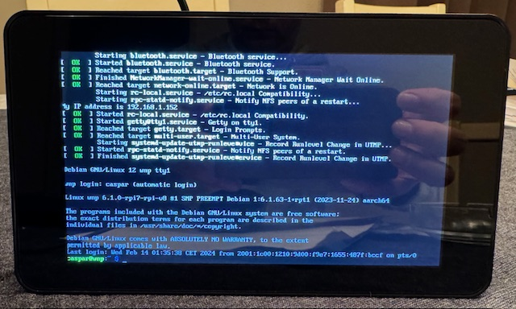

# Configuring the touchscreen

> [!NOTE]
> Skip this chapter if you are doing a headless installation!  
> Go directly to: [Add WNP to the Raspberry Pi](add-wnp-to-rpi.md)
>
> If you have a screen connected through HDMI you already should see some output.

At this step you still may not have an image on your touchscreen display. Please have a look at the manufacturers documentation in order to enable the display through the command prompt. You may need to configure some drivers or config files.

In my example I'm using a Raspberry Pi 4 with the official and original Raspberry Pi touchscreen. If you are familiar with those, the screen output is upside-down by default. So let's rectify that, while we are at it.

Please also refer to [Changing the screen orientation](https://www.raspberrypi.com/documentation/accessories/display.html#changing-the-screen-orientation) documentation by Raspberry Pi.

> [!IMPORTANT]
> Enabling the touchscreen is dependant on the manufacturers specification.  
> Please refer to the manual of the screen that you have gotten.  
> The below instructions are only valid for an original Raspberry Pi touchscreen!

::: tabs

=== Enable and rotate the display

1. Connect to the Raspberry Pi over SSH:  

   ```shell
   ssh username@servername.local
   ```

   *Where username and servername are the names you've chosen during the setup of the SD card.*

2. Start editing the cmdline.txt file by typing at the command prompt:  

   ```shell
   sudo nano /boot/firmware/cmdline.txt
   ```

3. At the end of the line add the following to rotate the display a 180 degrees:

   ```shell
    video=DSI-1:800x480@60,rotate=180
   ```

   > [!NOTE]
   > **There is a space before video= and after anything that is already on that line!**  
   > *We will use rotate=180 to put the display the right way up.*

4. Use CTRL+X -> Y to confirm -> Enter to confirm the filename.  
   The display rotation change should now have been set.

5. However the touch input should also be rotated. Type the following to edit the config.txt file:

   ```shell
   sudo nano /boot/firmware/config.txt
   ```

6. Find the line that says ``display_auto_detect=1``. Add a # in front to comment out that line.  
   Then add a line that says ``dtoverlay=vc4-kms-dsi-7inch,invx,invy``. So that it looks like this:  

   ```shell
   # Automatically load overlays for detected DSI displays
   #display_auto_detect=1

   # Rotate the touch input
   dtoverlay=vc4-kms-dsi-7inch,invx,invy
   ```

7. Then use CTRL+X -> Y to confirm -> Enter to confirm the filename.
8. In order for these changes to take effect we need to do a reboot:

   ```bash
   sudo reboot
   ```

=== Enable without rotating

1. Connect to the Raspberry Pi over SSH:  

   ```shell
   ssh username@servername.local
   ```

   *Where username and servername are the names you've chosen during the setup of the SD card.*

2. Type the following to edit the config.txt file:

   ```shell
   sudo nano /boot/firmware/config.txt
   ```

3. Find the line that says ``display_auto_detect=1``. Add a # in front to comment out that line.  

   Then add a line that says ``dtoverlay=vc4-kms-dsi-7inch``. So that it looks like this:  

   ```shell
   # Automatically load overlays for detected DSI displays
   #display_auto_detect=1

   # Enable the touchscreen driver over dsi
   dtoverlay=vc4-kms-dsi-7inch
   ```

4. Then use CTRL+X -> Y to confirm -> Enter to confirm the filename.
5. In order for these changes to take effect we need to do a reboot:

   ```bash
   sudo reboot
   ```

:::

Wait for the RPi to reboot. It may start upside-down first, but it will right itself eventually...



**Success!**

> [!NOTE]
> If you still do not have an image on your touchscreen, please re-read the manufacturers manual.  
> And/or read up on other peoples fixes. You may need another driver (dtoverlay), due to differing OS'es. Or specific settings required just for your display.
