# Prepare a Raspberry Pi OS - SD card

## Test your (touch)screen first

> [!TIP]
> If you are going down the (touch)screen route it is advised to first choose a version of **Rasperry Pi OS with Desktop**. Just to make sure that, if you pop in the SD card, you have a working screen.
> Afterwards follow the rest of this chapter.
>
> You can skip this test if you are going down the headless route.

Get familiar with the instructions of your screen manufacturer, if it doesn't work out-of-the-box. Then make note of those instructions, as we will need them for the proper WNP installation.

That includes the specific version of the OS you're meant to use as well. So that will either be the current or legacy version.

## Prepare the SD card

::: tabs

== RPi Imager

1. Download the latest [Raspberry Pi Imager tool](https://www.raspberrypi.com/software/) from <https://www.raspberrypi.com/software/> and install on your system.  
   This is also the way to update the Imager if you've previously had it installed.

2. After starting the Raspberry Pi Imager, select the device you will be installing on.  
  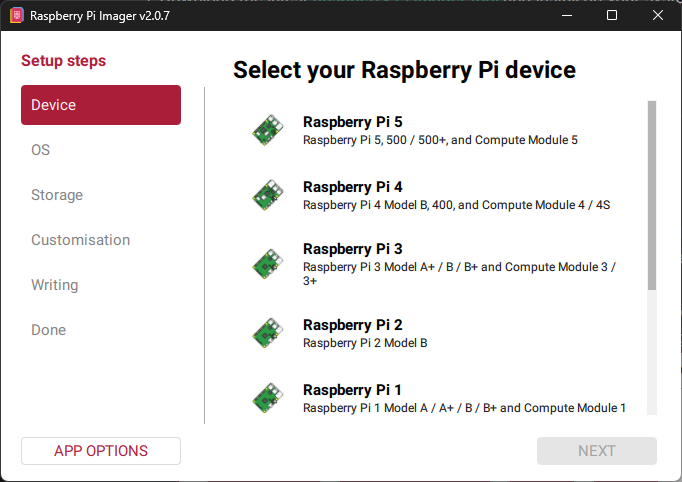
  *Select your device and click Next.*

3. Next up is the OS selection.  
   What we are looking for is the latest, 64 bit version *without a Desktop*, i.e. the **Lite version**.  
   Scroll down and select **Raspberry Pi OS (other)**  
   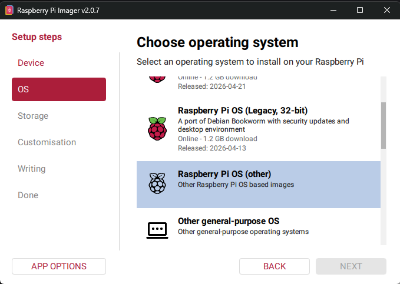

   The imager tool offers several Lite versions. You should be good with the latest Raspberry Pi OS Lite (64 bit) version, codename 'Trixie'.
   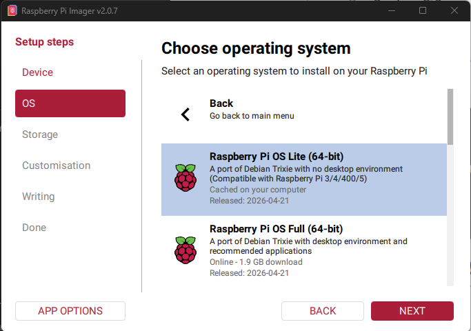
   *Select the Lite version and click Next.*

   > [!TIP]
   > If that version doesn't work out for you, you can try the 'Raspberry Pi OS Lite (32 bit)' version or the 'Raspberry Pi OS (Legacy, 64 bit) Lite' version, codename 'Bookworm'. WiiM Now Playing should work just fine on those as well.

4. Now is a good time to put the SD card, via an adapter, into your system.  
   The SD card will show up in the overview for you to select.

   > [!CAUTION]
   > If you have more than one removable media (external drives, USB sticks, SD cards) attached?  
   > Make sure that you select the proper SD card!  
   > The Imager **will overwrite everything on the SD card** in the following steps.  
   > You therefore do not need to format the SD card beforehand.

   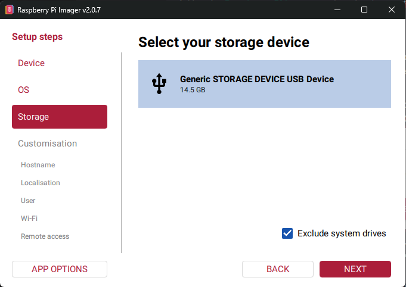
   *Select the SD card and click Next.*

5. The next steps make sure that you set up the OS for first deployment on your Raspberry Pi. Do not skip these customisation steps.  

   Enter the name you want to give your Raspberry Pi. This name will be used in the following instructions, keep it clear and concise, e.g.:  
   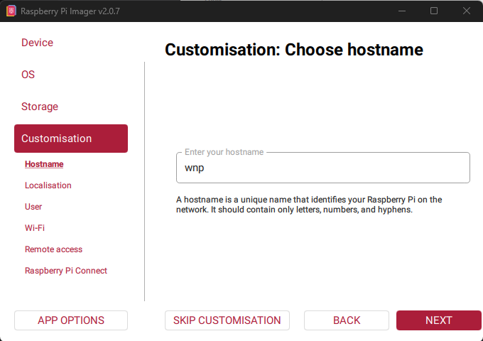
   *Enter a name and click Next.*

6. Set the Localisation to your specific region.  
   This will also be used for your WiFi connection.
   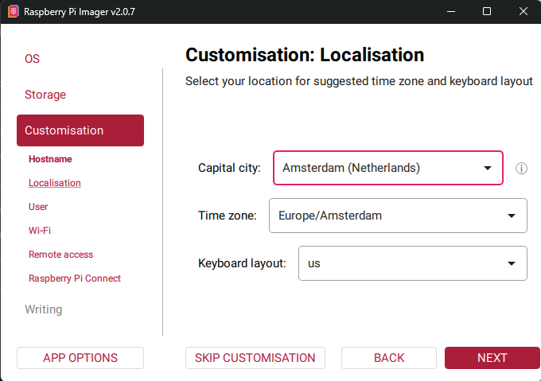
   *Select your capital city, time zone and keyboard layout. Then click Next.*

7. Next set the username you want to use. Make note of the username **and** password.  
   Making a typo here will lead to frustration, don't ask how I know why...  
   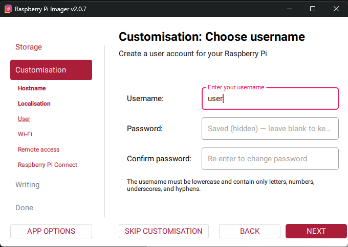
   *Set a username and password, click Next*

8. Now is a good time to provide the Raspberry Pi with the WiFi network it should connect to. 
   Again, make sure you don't make typo mistakes.  
   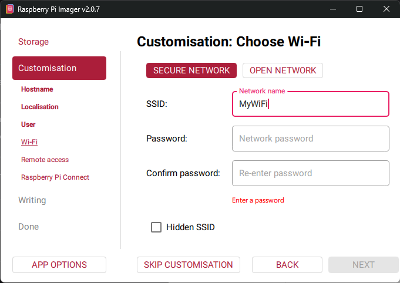
   *Set the network name (SSID) and provide the password, click Next.*

9. In order to manage the Raspberry Pi i.e. set it up over the network you should **enable SSH**. By default the username and password you set earlier will be used to log into the Raspberry Pi.
   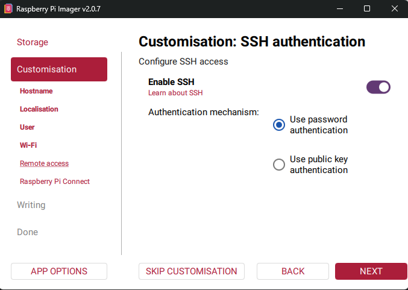
   *Enable SSH and select password authentication, click Next.*

10. The last step of the customisation is whether you would like to use Raspberry Pi Connect.  
    This isn't required for the setup of a WiiM Now Playing server. Do what you like, I've disabled this for now.
    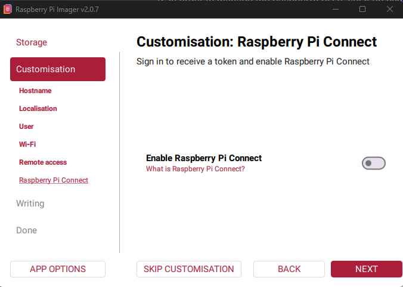
    *Disable or enable Connect, click Next.*

11. The Imager tool will provide you with a summary before committing it to the SD card.  
    Now is a good moment to make any changes if so required.
    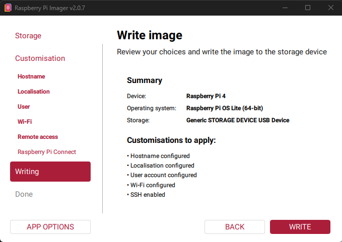
    *Check and click Write.*

    You will be asked to proceed one last time before writing everything to the SD card.
    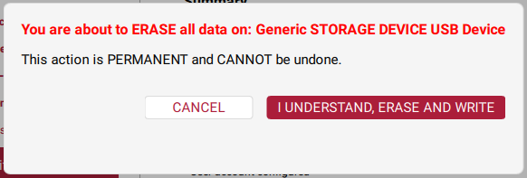
    *Start the erase and write action and wait for it to complete.*

== RPi Imager classic

These instruction are valid for the old version of the Raspberry Pi Imager.

1. Use the [Raspberry Pi Imager](https://www.raspberrypi.com/software/) to download a version of Raspberry Pi OS **Lite**. As we won't be needing a full desktop environment.  
2. First choose the Device you are going to use.  
3. Then choose the OS. Depending on your choice of device you'll be listed the compatibel OSes. Click on Raspberry Pi OS (other). Pick the Raspberry Pi OS Lite version. The top one (64 bit) will do fine.  
4. Choose your SD card. After selecting the SD card press Next. This will ask you whether you would like to apply customisations. Choose Edit Settings:  
   
5. In the General tab set the hostname of your RPi. Keep it short, simple and unique, you'll thank yourself later. In the example below I've used *wnp.local*, feel free to name it anyway you like.  
   Please also set a username and password as you will need those to connect to and setup later.  
     
   Also, if you are going to use WiFi, this is the moment to tell the RPi those details.
6. In the Services tab select Enable SSH and use the default 'use password authentication'. Please remember the username and password you've set in the General tab!  
     
7. Now press Save and Click Yes to apply the customisations. Now create the SD card and wait for it to finish.

:::

Congrats! You now have an SD card ready to be used with your Raspberry Pi. Take it out of your machine.

Pop it into your Raspberry Pi and follow the [First time configuration](first-time-config.md) steps.
