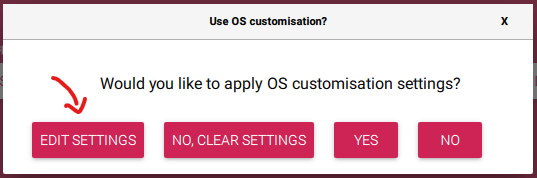
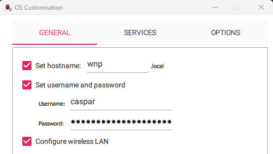
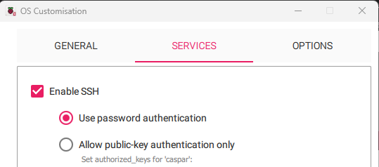

# Prepare a Raspberry Pi OS - SD card

## Test your (touch)screen first

> [!TIP]
> If you are going down the (touch)screen route it is advised to choose a version of Rasperry Pi OS with Desktop. Just to make sure that, if you pop in the SD card, you have a working screen.

You can skip this if you are going down the headless route. Follow the instructions below and choose the OS version for your RPi, but with Desktop.

Get familiar with the instructions of your screen manufacturer, if it doesn't work out-of-the-box. Then make note of those instructions, as we will need them for the proper WNP installation.

That includes the specific version of the OS you're meant to use as well. So that will either be the current or legacy version.

## Prepare the SD card

::: tabs

== RPi Imager

1. Use the [Raspberry Pi Imager](https://www.raspberrypi.com/software/) to download a version of Raspberry Pi OS **Lite**. As we won't be needing a full desktop environment.  
2. First choose the Device you are going to use.  
3. Then choose the OS. Depending on your choice of device you'll be listed the compatibel OSes. Click on Raspberry Pi OS (other). Pick the Raspberry Pi OS Lite version. The top one (64 bit) will do fine.  
4. Choose your SD card. After selecting the SD card press Next. This will ask you whether you would like to apply customisations. Choose Edit Settings:  
   
5. In the General tab set the hostname of your RPi. Keep it short, simple and unique, you'll thank yourself later. In the example below I've used *wnp.local*, feel free to name it anyway you like.  
   Please also set a username and password as you will need those to connect to and setup later.  
     
   Also, if you are going to use WiFi, this is the moment to tell the RPi those details.
6. In the Services tab select Enable SSH and use the default 'use password authentication'. Please remember the username and password you've set in the General tab!  
     
7. Now press Save and Click Yes to apply the customisations. Now create the SD card and wait for it to finish.
8. After finishing put the SD card in your RPi. Power up your RPi and wait for the setup to complete.  
   If successful you will be greeted with a command prompt on your screen.

== RPi Imager classic

1. Use the [Raspberry Pi Imager](https://www.raspberrypi.com/software/) to download a version of Raspberry Pi OS **Lite**. As we won't be needing a full desktop environment.  
2. First choose the Device you are going to use.  
3. Then choose the OS. Depending on your choice of device you'll be listed the compatibel OSes. Click on Raspberry Pi OS (other). Pick the Raspberry Pi OS Lite version. The top one (64 bit) will do fine.  
4. Choose your SD card. After selecting the SD card press Next. This will ask you whether you would like to apply customisations. Choose Edit Settings:  
   
5. In the General tab set the hostname of your RPi. Keep it short, simple and unique, you'll thank yourself later. In the example below I've used *wnp.local*, feel free to name it anyway you like.  
   Please also set a username and password as you will need those to connect to and setup later.  
     
   Also, if you are going to use WiFi, this is the moment to tell the RPi those details.
6. In the Services tab select Enable SSH and use the default 'use password authentication'. Please remember the username and password you've set in the General tab!  
     
7. Now press Save and Click Yes to apply the customisations. Now create the SD card and wait for it to finish.
8. After finishing put the SD card in your RPi. Power up your RPi and wait for the setup to complete.  
   If successful you will be greeted with a command prompt on your screen.

:::
