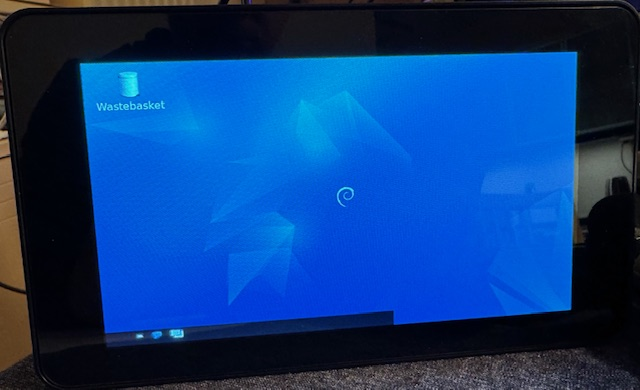

# Enable Kiosk mode on a Raspberry Pi

Now that you've configured the RPi and the wiim-now-playing app (server part) to run every time the RPi (re)boots, we would like to show the client on the (touch)screen as well.

## Configuring Kiosk mode

For this we need:

* To get the chromium browser to also start automatically in kiosk mode and point to the wiim-now-playing app.
* Install a lightweight desktop environment, LXDE, to run the chromium browser on.

Follow these steps:

1. Make an SSH connection to the RPi:

   ```shell
   ssh wnp.local
   ```

2. Install the chromium browser and some basic desktop functionality (LXDE) by using the following commands to install the required applications:

   ::: tabs

   == Modern (Trixie)

   ```bash
   sudo apt install chromium
   sudo apt install unclutter
   sudo apt install lxde
   ```

   == Legacy (Bookworm/Bullseye)

   ```bash
   sudo apt install chromium-browser
   sudo apt install unclutter
   sudo apt install lxde
   ```

   :::

   > [!TIP]
   > This will take a while! If your SSH connection is broken off, please wait a while before reconnecting. Just let it do its thing.
   >
   > If the RPi stays unresponsive for a long time it may take a power off from the RPi to return to normal operation.

3. Once the installations are done, and you can reconnect, then change the startup behaviour by opening  

   ```shell
   sudo raspi-config
   ```

4. Enter the **1 System Options**  
   Enter **S5 Boot**  
   Select **B2 Desktop Gui**  

   Re-enter the **1 System Options**  
   **S6 Auto Login**.  
   Answer **&lt;Yes&gt;** to automatically log in to the Desktop GUI.  

   Finish and reboot.

5. You will now be greeted by a desktop environment on the RPi display instead of a command prompt.

   

6. Reconnect to the RPi through SSH.  
   Use the following command to edit the LXDE autostart file:

   ```shell
   sudo nano .config/lxsession/LXDE/autostart
   ```

7. Edit the autostart file by commenting out all of the lines already present.  
   Add a line at the end like ``@/home/username/autostart.sh``.  
   Replace username with **your** username!

   ```shell
   #@lxpanel --profile LXDE
   #@pcmanfm --desktop --profile LXDE
   #@xscreensaver -no-splash

   @/home/username/autostart.sh
   ```

8. Then use CTRL+X -> Y to confirm -> Enter to confirm the filename.
9. Next we will create and edit the autostart.sh file. Use:

   ```shell
   nano autostart.sh
   ```

   > [!NOTE]
   > Sudo is not required for this step!

10. Add the following lines to the autostart.sh file:  

    ::: tabs

    == Modern (Trixie)

    ```bash
    #!/bin/bash

    # Start chromium in Kiosk mode
    echo "WNP: Start chromium..."
    sed -i 's/"exited_cleanly": false/"exited_cleanly": true/' ~/.config/chromium/Default/Preferences
    sed -i 's/"exit_type":"Crashed"/"exit_type":"Normal"/' ~/.config/chromium/Default/Preferences
    chromium --kiosk --noerrdialogs --incognito --disable-infobars --no-first-run --password-store=basic http://localhost

    exit 0
    ```

    == Legacy (Bookworm/Bullseye)

    ```bash
    #!/bin/bash

    # Start chromium-browser in Kiosk mode
    echo "WNP: Start chromium-browser..."
    sed -i 's/"exited_cleanly": false/"exited_cleanly": true/' ~/.config/chromium/Default/Preferences
    chromium-browser --app=http://localhost/ --kiosk --noerrdialogs --incognito --hide-scrollbars --no-first-run --window-size=800,480 --password-store=basic

    exit 0
    ```

    :::

11. Then use CTRL+X -> Y to confirm -> Enter to confirm the filename.
12. Before we do a reboot we need to make autostart.sh executable, use:

    ```shell
    chmod +x autostart.sh
    ```

13. Now do a reboot of the RPi.

    ```shell
    sudo reboot
    ```

14. Wait for the RPi to reboot. This may take a while...  

    

> [!TIP]
> Congrats with your working touchscreen!
>
> However, you will find that after a reboot or after the screen went to sleep, things will stop working.
>
> Please read on below to set the kiosk mode to your liking.

### Troubleshooting

* If the screen looks garbled/unstyled, wait a little while for it to settle.  
  Or try a power cycle by unplugging the RPi completely, wait and then plug it in again.
* Try and add a ``sleep`` in front of the chromium browser line, like:  
  
  ```bash
  sleep 5 && chromium --kiosk ...
  ```

  This will delay the start of the browser in order to let the OS settle first.

## Screen(saver) locking

One unfortunate behaviour of letting your display fall asleep is that when you do wake it up, by touching the screen, it will prompt you for your password. This is good basic security behaviour for any desktop, but not for a kiosk mode application. Not in the least because you won't have a keyboard attached.

In order to stop the screen locking in an LXDE environment do the following:

1. Connect to your RPi through SSH.

2. From the command line create a new local autostart folder in .config:

   ```shell
   mkdir -p ~/.config/autostart
   ```

3. Copy the light-locker configuration file to the new autostart folder in your home/.config folder.

   ```shell
   cp /etc/xdg/autostart/light-locker.desktop ~/.config/autostart
   ```

4. Now edit this file with:

   ```shell
   sudo nano .config/autostart/light-locker.desktop
   ```

5. Scroll down to the end of the text. There you will find a line, similar to:

   ```bash
   NotShowIn=GNOME;Unity;
   ```

   Add ``LXDE;`` to the end like so:

   ```bash
   NotShowIn=GNOME;Unity;LXDE;
   ```

6. Use CTRL+X -> Y to confirm -> Enter to confirm the filename.
7. Do a ``sudo reboot`` to let the changes take effect.  
   Wait for the display to fall asleep and tap the screen. You will no longer get a login screen.

Now that you have a working Kiosk mode, you may want to check out the [additional kiosk configuration](additional-kiosk-settings.md).
