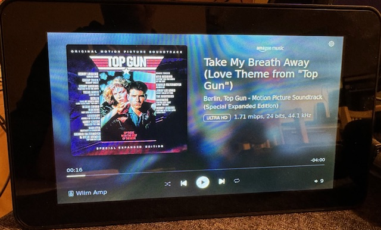
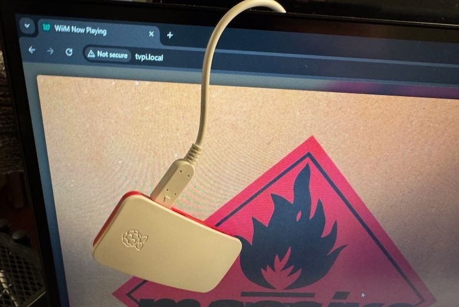

# Use cases

WiiM Now Playing can be set up with different use cases in mind. Below you'll find some scenario's. If you can think of another one, please be my guest to explore either route.

## Go for an attached touchscreen, when

**Scenario 1**: You want to have a passive screen on your desk or near your stereo, that when something catches your ears you want to know what it is that is playing now.

**Scenario 2**: You work from home, having some nice tunes playing to keep you company/focussed. Then suddenly you are interrupted, like someone calling, and you want to mute/pause the WiiM device immediately.

I.e. faster than reaching for your phone, opening the WiiM Home app and pause. Or reach for your amp and turn down the volume.

**Scenario 3**: You are going through some playlists while hanging back. Then you're not into that one song and want to skip quickly. Or want to play it again.

[>> Go for the touchscreen route](setup-touchscreen.md)

## Don't bother with an attached screen, when

**Scenario 1**: You want to see from across the room what your WiiM device is playing now. You do not fancy all the touchscreen stuff and just want to see it for example on your TV.

**Scenario 2**: You just want to get the now playing information anywhere there's a capable screen with a browser. For example as an extra browser tab on your laptop or repurposing an old tablet you were not really using any longer.

  
*An example of a Raspberry Pi Zero 2 W in headless configuration.  
With the now playing information shown in a browser in the background.*

[>> Go for the headless route](setup-headless.md)

## You want to run it locally on your computer, when

**Scenario 1**: Your daily computer is all you have and want. Install the app locally, either with or without [Docker](../getting-started/docker.md).

[>> See the Getting started section](../getting-started/)
